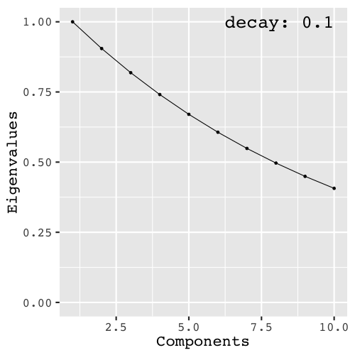

```{r setup, include=FALSE}
## Knitr Options
options(htmltools.dir.version = FALSE, digits = 3, signif = 999)
## Chunk Options
knitr::opts_chunk$set(
  echo = FALSE, comment = NULL, eval = TRUE,
  dev = 'svg', out.width='95%', fig.retina=2,
  fig.align = 'center', warning = FALSE,
  message = FALSE)
## Hightlight part of code hook
hook_source <- knitr::knit_hooks$get('source')
knitr::knit_hooks$set(source = function(x, options) {
  x <- stringr::str_replace(x, "^[[:blank:]]?([^*].+?)[[:blank:]]*#<<[[:blank:]]*$", "*\\1")
  hook_source(x, options)
})
## Source the script file for creating relevant space
source("_script/00-function.r")
source("_script/relevant-space.R")
## Load packages
library(tidyverse)
library(simrel)
library(gridExtra)
library(pls)
```

background-image: url(_images/logo-nb.png)
background-size: 30%
background-position: center
background-repeat: no-repeat

---
class: center, middle, inverse

# Linear Model
## Relevant and irrelevant space in linear model

---

class: top

.left-column[
# Linear Model

```{r, out.width='100%', dev='svg', fig.asp=0.6, fig.align='center', fig.width=5, eval = TRUE}
col_vec <- rev(RColorBrewer::brewer.pal(3, "Set1"))
rel_col <- alpha(col_vec[2], 1)
irrel_col <- alpha(col_vec[1], 0.2)
plt <- plot_model(rel_col, irrel_col, 1, 0.6)
grid.newpage()
grid.draw(grid_by_name(plt,"rect_box|labels|arrow_ann"))
```


```{r}
set.seed(777)
sobj <- simrel(
  n = 20,
  p = 10,
  q = 10,
  relpos = 1:4,
  R2 = 0.8,
  gamma = 0.9,
  type = "univariate"
)
```


```{r, fig.width = 4, dev= 'svg', fig.asp = 1, fig.align='left', out.width = '100%'}
plot_cov(sobj, type = "relpred", ordering = FALSE, facetting = FALSE) +
  theme(legend.position = "none")
```

]

.right-column[

### The Model:

$$\begin{bmatrix}
  y \\ \mathbf{x}
\end{bmatrix} 
\sim \mathsf{N}\left(
  \begin{bmatrix}
    \mu_y \\
    \boldsymbol{\mu}_x
  \end{bmatrix},
  \begin{bmatrix}
    \sigma_{y}^2 & \boldsymbol{\sigma}_{yx}\\ 
    \boldsymbol{\sigma}_{xy} & \boldsymbol{\Sigma}_{xx}
  \end{bmatrix}
\right)$$

### Linear Regression:

$$y = \mu_y + \boldsymbol{\beta}^t(\mathbf{x} - \boldsymbol{\mu}_x) + \varepsilon,\; \varepsilon \sim \mathsf{N}(0, \sigma^2)$$

### Regression Coefficients:

$$\boldsymbol{\beta} = \boldsymbol{\Sigma}_{xx}^{-1}\boldsymbol{\sigma}_{xy}$$

]

---

class: top

.left-column[
# Linear Model

```{r, out.width='100%', dev='svg', fig.asp=0.6, fig.align='center', fig.width=5, eval = TRUE}
col_vec <- rev(RColorBrewer::brewer.pal(3, "Set1"))
rel_col <- alpha(col_vec[2], 1)
irrel_col <- alpha(col_vec[1], 0.2)
plt <- plot_model(rel_col, irrel_col, 1, 0.6)
grid.newpage()
grid.draw(grid_by_name(plt,"rect_box|xrel_space|labels|in_labels|arrow_ann"))
```


```{r}
set.seed(777)
sobj <- simrel(
  n = 20,
  p = 10,
  q = 10,
  relpos = 1:4,
  R2 = 0.8,
  gamma = 0.9,
  type = "univariate"
)
```


```{r, fig.width = 4, dev= 'svg', fig.asp = 1, fig.align='left', out.width = '100%'}
plot_cov(sobj, type = "relpos", ordering = FALSE, facetting = FALSE) +
  theme(legend.position = "none")
```

]

.right-column[
Let us make a transformation as $\boldsymbol{z} = \mathbf{R} \boldsymbol{x}$ where $\mathbf{R}$ is an orthogonal matrix, i.e. $\mathbf{R}^t = \mathbf{R}^{-1}$.

### New Model

$$\begin{bmatrix}
  y \\ \mathbf{z}
\end{bmatrix} 
\sim \mathsf{N}\left(
  \begin{bmatrix}
    \mu_y \\
    \boldsymbol{\mu}_z
  \end{bmatrix},
  \begin{bmatrix}
    \sigma_{y}^2 & \boldsymbol{\sigma}_{yz}\\ 
    \boldsymbol{\sigma}_{zy} & \boldsymbol{\Sigma}_{zz}
  \end{bmatrix}
\right) = 
\mathsf{N}\left(
  \begin{bmatrix}
    \mu_y \\
    \boldsymbol{\mu}_z
  \end{bmatrix},
  \begin{bmatrix}
    \sigma_{y}^2 & \boldsymbol{\sigma}_{yx} \mathbf{R}^t\\ 
    \mathbf{R}\boldsymbol{\sigma}_{xy} & \mathbf{R}\boldsymbol{\Sigma}_{xx} \mathbf{R}^t
  \end{bmatrix}
\right)$$

### Linear Regression
$$y = \mu_y + \boldsymbol{\alpha}^t(\mathbf{z} - \boldsymbol{\mu}_z) + \epsilon,\; \epsilon \sim \mathsf{N}(0, \tau^2)$$

### Regression Coefficients
$$\boldsymbol{\alpha} = \mathbf{R} \boldsymbol{\beta} = \boldsymbol{\Sigma}_{zz}^{-1}\boldsymbol{\sigma}_{zy} = \Lambda^{-1} \boldsymbol{\sigma}_{zy} = \sum_{i = 1}^p\frac{\sigma_{z_iy}}{\lambda_i}$$

]

---

class: top

.left-column[
# Simulation

```{r}
set.seed(777)
design <- crossing(
  gamma = c(0.1, 1.2),
  relpos = list(1:5, 5:10),
  Method = c("PCR", "PLS"),
  Replication = 1:10
)
sim_obj <- design %>% 
  mutate(relpos_chr = map_chr(relpos, deparse)) %>% 
  mutate(sobj = map2(gamma, relpos, ~simrel(
    n = 20,
    p = 30,
    q = 30,
    gamma = ..1,
    relpos = ..2,
    R2 = 0.8,
    ntest = 50,
    type = "univariate"
  )))
```

```{r design_print}
design %>% 
  select(gamma, relpos, Method) %>% 
  unique() %>% 
  mutate(Design = rep(paste("Design", 1:4), 2)) %>% 
  mutate(relpos = map_chr(relpos, deparse)) %>%
  select(Design, gamma, relpos, Method) %>% 
  as.data.frame()
```



]

.right-column[
## Relevant Components
### Low Multicollinearity

```{r}
sobj_low <- sim_obj %>% 
  filter(gamma == 0.1, relpos_chr == "1:5") %>% 
  slice(1) %>% 
  pluck("sobj") %>% 
  pluck(1)
```

```{r, fig.asp=0.7, fig.width=8}
mklbl <- function(txt) {
  textGrob(txt, gp = gpar(cex = 1.4, lineheight = 2, fontface = "bold"))
}
plt11 <- plot_simrel(sobj_low, which = 2, use_population = TRUE)
plt12 <- plot_simrel(sobj_low, which = 4, use_population = TRUE) +
  labs(y = NULL)
plt1_ <- arrangeGrob(plt11, plt12, top = mklbl("Population"), nrow = 1)

plt21 <- plot_simrel(sobj_low, which = 3, use_population = FALSE)
plt22 <- plot_simrel(sobj_low, which = 4, use_population = FALSE) +
  labs(y = NULL)
plt2_ <- arrangeGrob(plt21, plt22, top = mklbl("Sample"), nrow = 1)
grid.draw(arrangeGrob(plt1_, plt2_, nrow = 2))
```

]

---

class: top

.left-column[
# Simulation

```{r design_print}
```


]

.right-column[
## Relevant Components
### High Multicollinearity

```{r}
sobj_high <- sim_obj %>% 
  filter(gamma == 1.2, relpos_chr == "1:5") %>% 
  slice(1) %>% 
  pluck("sobj") %>% 
  pluck(1)
```

```{r, fig.asp=0.7, fig.width=8}
mklbl <- function(txt) {
  textGrob(txt, gp = gpar(cex = 1.4, lineheight = 2, fontface = "bold"))
}
plt11 <- plot_simrel(sobj_high, which = 2, use_population = TRUE)
plt12 <- plot_simrel(sobj_high, which = 4, use_population = TRUE) +
  labs(y = NULL)
plt1_ <- arrangeGrob(plt11, plt12, top = mklbl("Population"), nrow = 1)

plt21 <- plot_simrel(sobj_high, which = 3, use_population = FALSE)
plt22 <- plot_simrel(sobj_high, which = 4, use_population = FALSE) +
  labs(y = NULL)
plt2_ <- arrangeGrob(plt21, plt22, top = mklbl("Sample"), nrow = 1)
grid.draw(arrangeGrob(plt1_, plt2_, nrow = 2))
```

]

---
class: top
exclude: false

```{r}
get_corplot <- function(obj, population = TRUE, title = NULL) {
  if (population) {
    cor_mat <- cov2cor(t(obj$Rotation) %*% obj$Sigma[-1, -1] %*% obj$Rotation)
  } else {
    cor_mat <- cor(obj$X)
  }
  corrplot::corrplot(
    corr = cor_mat, 
    method = "shade", 
    order = "hclust", 
    hclust.method = "average", 
    tl.col = "black", 
    tl.cex = 0.7,
    tl.srt = 0, 
    tl.pos = "n", 
    title = title, 
    mar = c(1, 0, 2, 0))
}
```

.left-40-column[

## Correlation Structure

.flex-box[

```{r, fig.width=5, out.width='100%', fig.asp=1}
get_corplot(sobj_high, population = TRUE, title = "High Correlation in Population")
```

```{r, fig.width=5, out.width='100%', fig.asp=1}
get_corplot(sobj_low, population = TRUE, title = "Low Correlation in Population")
```

]

.flex-box[

```{r, fig.width=5, out.width='100%', fig.asp=1}
get_corplot(sobj_high, population = FALSE, title = "High Correlation in Sample")
```

```{r, fig.width=5, out.width='100%', fig.asp=1}
get_corplot(sobj_low, population = FALSE, title = "Low Correlation in Sample")
```

]
]
.right-60-column[
## Structure of Simulated Data

```{r}
options(knitr.kable.NA = "...")
dta_high <- as_tibble(with(sobj_high, data.frame(y = Y, x = X)))
dta_high_print <- bind_cols(
  dta_high %>% select(1:5),
  "..." = rep(NA, 20),
  dta_high %>% select(28:31)
)
knitr::kable(head(dta_high_print, 10), format = "html") %>% 
  kableExtra::kable_styling(
    full_width = TRUE, 
    font_size = 10,
    bootstrap_options = "condensed") %>% 
  kableExtra::row_spec(0:10, monospace = TRUE)
```

]


---

class: top

# Prediction Performance

```{r}
err <- sim_obj %>% 
  mutate(fit = map2(Method, sobj, function(mthd, obj) {
    fn <- switch(mthd, PCR = pcr, PLS = plsr)
    train <- with(obj, data.frame(x = I(X), y = I(Y)))
    mdl <- as.function(fn)(y ~ x, data = train, validation = "LOO")
    return(mdl)
  })) %>% 
  mutate(pred_err = map2(fit, sobj, function(fit, obj) {
    test <- with(obj, data.frame(x = I(TESTX), y = I(TESTY)))
    err <- RMSEP(fit, newdata = test, 
                 estimate = "all", ncomp = 1:12)
    err_df <- err %>% 
      pluck("val") %>% 
      drop() %>% 
      as.data.frame() %>% 
      rownames_to_column(var = "estimate") %>% 
      gather("Model", "RMSE", -estimate)
    return(err_df)
  }))
  
  err_df <- err %>% 
    select(gamma, relpos_chr, Method, Replication, pred_err) %>% 
    unnest() %>% 
    mutate(Model = parse_number(Model) %>% replace_na(0)) %>% 
    rename(relpos = relpos_chr)
  attributes(err_df$Model) <- NULL
```

```{r}
make_pred_plot <- function(mthd) {
  err_df %>% 
    filter(Method == mthd, estimate != "adjCV") %>% 
    ggplot(
      aes( x = Model, y = RMSE, color = estimate)
    ) + facet_grid(gamma ~ relpos, labeller = label_both) +
    stat_summary(fun.y = mean, geom = "line", 
                 aes(group = estimate)) +
    stat_summary(fun.y = mean, geom = "point") +
    theme(axis.text.x = element_text(angle = 90, hjust = 1),
          legend.position = "bottom") +
    labs(
      x = "Number of Components",
      y = "Root Mean Square Errors",
      title = glue::glue("Prediction Error from {mthd} Methods"),
      subtitle = "Averaged over 10 replicated fit",
      color = NULL
    ) + expand_limits(y = 0) +
    scale_y_continuous(breaks = seq(0, 1.25, 0.25)) +
    scale_x_continuous(breaks = seq(0, 12, 1)) +
    coord_cartesian(ylim = c(0, 1.25))
}
```


.left-column[
## Principal Component Regression

]
.right-column[

```{r, fig.asp=0.7, fig.width=7, out.width='100%'}
make_pred_plot("PCR")
```

]

---

class: top

# Prediction Performance

.left-column[
## Partial Least Square Regression

]
.right-column[

```{r, fig.asp=0.7, fig.width=7, out.width='100%'}
make_pred_plot("PLS")
```

]

---

class: top

.left-40-column[

## Error Comparison

```{r}
min_cv_err <- err_df %>%
  filter(estimate == "CV") %>% 
  group_by(gamma, relpos, Method, Model) %>% 
  summarise(RMSE = mean(RMSE)) %>% 
  group_by(gamma, relpos, Method) %>% 
  summarize(Model = Model[which.min(RMSE)],
            RMSECV = min(RMSE))
min_test_err <- err_df %>% 
  filter(estimate == "test") %>% 
  group_by(gamma, relpos, Method, Model) %>% 
  summarize(RMSE = mean(RMSE)) %>% 
  group_by(gamma, relpos, Method) %>% 
  semi_join(min_cv_err, 
            by = c("gamma", "relpos", "Method", "Model")) %>% 
  rename(RMSEP = RMSE)
min_err <- inner_join(min_cv_err, min_test_err) %>% 
  rename(Component = Model)
```


```{r}
dbl2df <- function(x, name = NULL) {
  df <- data.frame(obs = seq_along(x), value = x)
  if (!is.null(name)) names(df)[2] <- name
  return(df)
}
pred_df <- err %>% 
  select(gamma, relpos = relpos_chr, Method, 
        Replication, sobj, fit) %>% 
  left_join(min_err %>% select(gamma:Component)) %>% 
  mutate(TrueY = map(sobj, "TESTY")) %>%
  mutate(PredY = pmap(list(sobj, fit, Component), function(x, y, z) {
    predict(y, newdata = x$TESTX, ncomp = z) %>% drop()
  })) %>% 
  mutate(Method = paste0(Method, ":", Component)) %>% 
  select(gamma:Replication, TrueY, PredY) %>% 
  mutate(TrueY = map(TrueY, dbl2df, "True")) %>% 
  mutate(PredY = map(PredY, dbl2df, "Pred"))
```

```{r}
pred_df_ <- inner_join(
  pred_df %>% unnest(TrueY),
  pred_df %>% unnest(PredY),
  by = c("gamma", "relpos", "Method", "Replication", "obs")
) %>% 
  gather(Type, value, True:Pred)
```

```{r, fig.asp=0.6}
plt1 <- pred_df_ %>% filter(grepl("PCR", Method)) %>% 
  ggplot(aes(obs, value, color = Type)) +
  stat_summary(fun.y = mean, geom = "point") +
  stat_summary(fun.y = mean, geom = "line", aes(group = Type)) +
  stat_summary(fun.data = mean_se, geom = "ribbon", alpha = 0.2, aes(fill = Type),
               color = NA) +
  facet_wrap(relpos ~ gamma, labeller = label_both) +
  scale_y_continuous(breaks = seq(-1, 1, 0.5)) +
  coord_cartesian(ylim = c(-1, 1)) +
  expand_limits(y = c(-1, 1)) +
  labs(x = "Observations",
       y = "Response (Y)",
       title = "Predictions using PCR")
```

```{r, fig.asp=0.6}
plt2 <- pred_df_ %>% filter(grepl("PLS", Method)) %>% 
  ggplot(aes(obs, value, color = Type)) +
  stat_summary(fun.y = mean, geom = "point") +
  stat_summary(fun.y = mean, geom = "line", aes(group = Type)) +
  stat_summary(fun.data = mean_se, geom = "ribbon", alpha = 0.2, aes(fill = Type),
               color = NA) +
  facet_wrap(relpos ~ gamma, labeller = label_both) +
  scale_y_continuous(breaks = seq(-1, 1, 0.5)) +
  coord_cartesian(ylim = c(-1, 1)) +
  expand_limits(y = c(-1, 1)) +
  labs(x = "Observations",
       y = "Response (Y)",
       title = "Predictions using PLS")
```

```{r, fig.asp=1.2}
ggpubr::ggarrange(plt1, plt2, nrow = 2, legend = "bottom", common.legend = TRUE)
```


]
.right-60-column[

### Estimation and Prediction Error

```{r}
est_err <- err %>% 
  select(gamma, relpos = relpos_chr, Method, 
        Replication, sobj, fit) %>% 
  left_join(min_err %>% select(gamma:Component)) %>% 
  mutate(est_err = pmap_dbl(list(sobj, fit, Component), function(x, y, z){
    true_beta <- x[["beta"]] %>% drop()
    est_beta <- y[["coefficients"]][,,z, drop = FALSE] %>% drop()
    est_err <- c(t(true_beta - est_beta) %*% (true_beta - est_beta))
    return(est_err)
  }))
```

```{r}
err_print <- est_err %>% 
  group_by(gamma, relpos, Method) %>% 
  summarize(EstErr = mean(est_err),
            Model = unique(Component)) %>% 
  inner_join(min_cv_err) %>% 
  rownames_to_column(var = "Design") %>% 
  rename(Component = Model) %>% 
  select(Design:Method, Component, EstErr, RMSECV)
knitr::kable(err_print, format = "html") %>% 
  kableExtra::kable_styling(
    full_width = TRUE, 
    font_size = 10,
    bootstrap_options = "condensed") %>% 
  kableExtra::row_spec(0:8, monospace = TRUE)
```


```{r, fig.asp=0.6}
est_err %>% 
  group_by(gamma, relpos, Method) %>% 
  summarize(EstErr = mean(est_err),
            Model = unique(Component)) %>% 
  inner_join(min_cv_err) %>% 
  gather(Error_Type, Value, EstErr, RMSECV) %>% 
  ggplot(aes(factor(gamma), Value, color = Method)) +
  geom_line(aes(group = Method)) +
  geom_point() +
  facet_grid(relpos ~ Error_Type, scales = "free_y",
             labeller = label_both) +
  labs(x = "Multicollinearity Decay Factor",
       y = "Error") +
  theme(legend.position = "bottom")
```


]

---

class: top

# References
.references[

```{r, load_refs, echo=FALSE}
library(RefManageR)

BibOptions(check.entries = FALSE, 
           bib.style = "authoryear", 
           cite.style = 'alphabetic', 
           style = "markdown",
           hyperlink = FALSE, 
           dashed = FALSE)
myBib <- ReadBib("./references.bib", check = FALSE)
invisible(AutoCite(myBib))
```

```{r, print_refs, results='asis', echo=FALSE, warning=FALSE, message=FALSE}
PrintBibliography(myBib, start = 1, end = 5)
```

]

---

# Installation
.flex-box[
.installation-details[

## R-Package

```{r, eval = FALSE, echo = TRUE}
install.packages("simrel")

if (!require(devtools)) install.packages("devtools")
devtools::install_github("simulatr/simrel")
```

## Shiny Application

```{r, eval = FALSE, echo = TRUE}
if (!require(simrel)) install.packages("simrel")
shiny::runGitHub("simulatr/AppSimulatr")
```

]

```{r, out.extra="id='simrel-hex'", fig.asp=1, out.width='75%'}

```

]

---
background-image: url(_images/ThankYou.png)
background-size: cover
background-position: center
background-repeat: no-repeat

